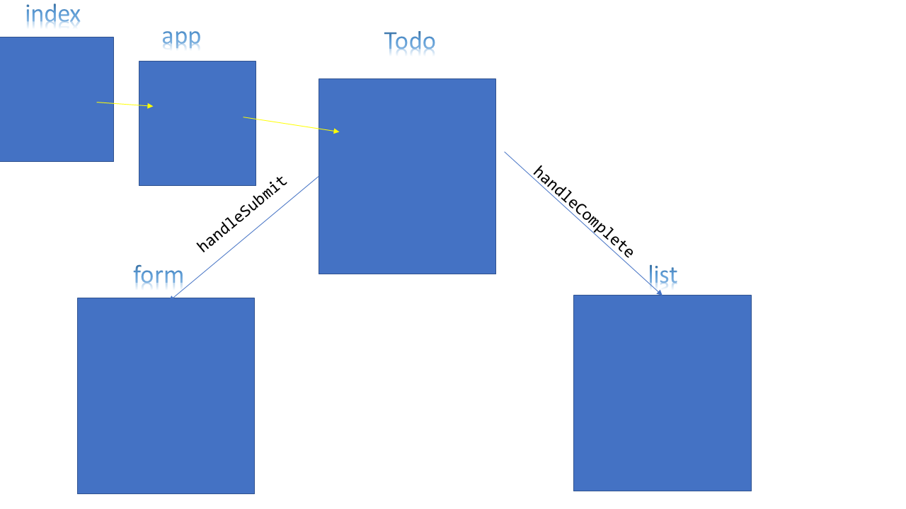

# LAB: todo
an application designed for creating and organizing a “To Do” list in your browser.
### Author: Osama Mousa

### Links and Resources

- [submission PR class-31](https://github.com/401-advanced-javascript-osama/todo/pull/1)

### deployment links

[Netlify](https://focused-fermi-790431.netlify.app/)

#### How to initialize/run your application

- `npm start`

#### UML

