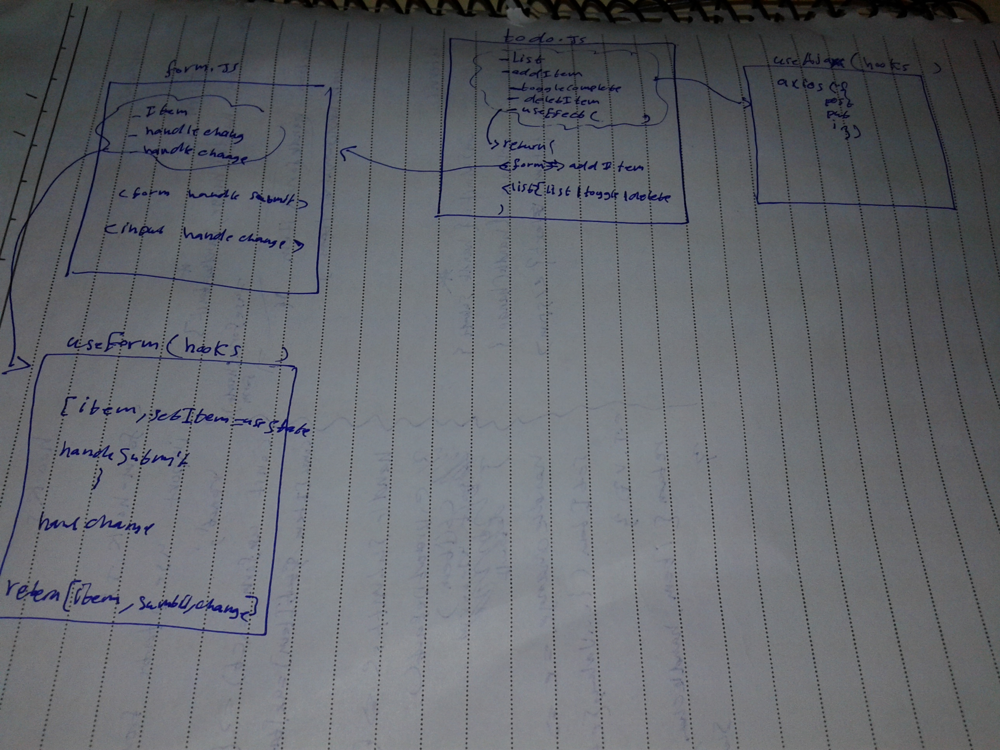

# LAB: todo
connecting our application to an API so that our list will be saved permanently. This will require a working and deployed API server with a proper “To Do” data model and appropriate REST routes 
### Author: Osama Mousa

### Links and Resources

- [submission PR class-31](https://github.com/401-advanced-javascript-osama/todo/pull/2)

### deployment links

#### How to initialize/run your application

- `npm start`

#### UML

